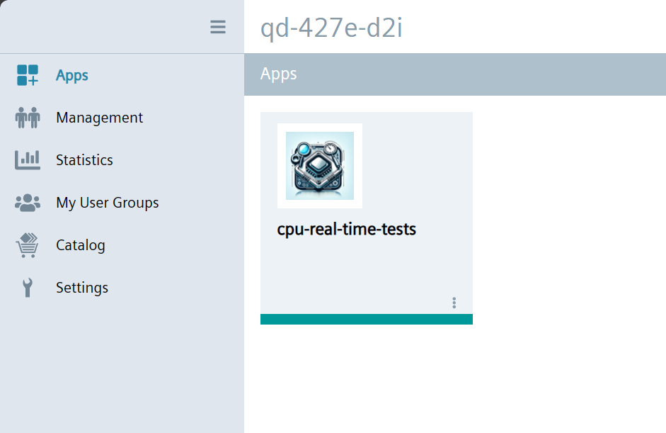
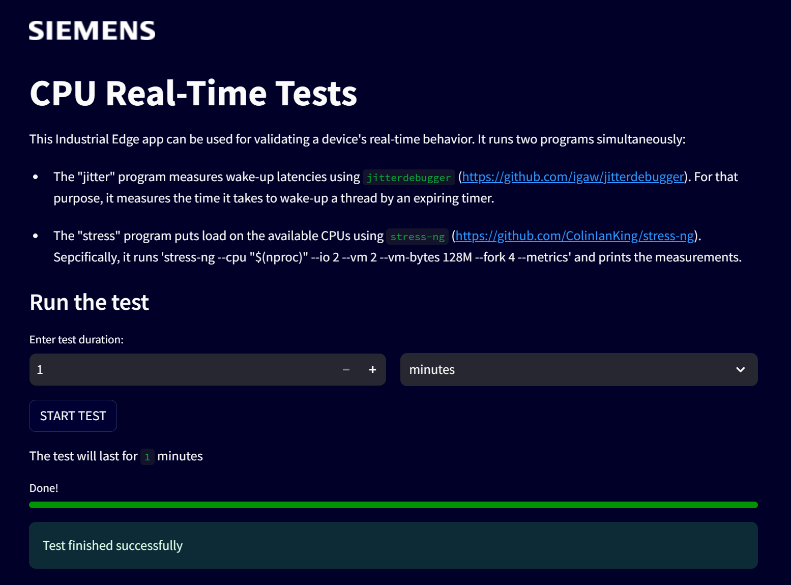
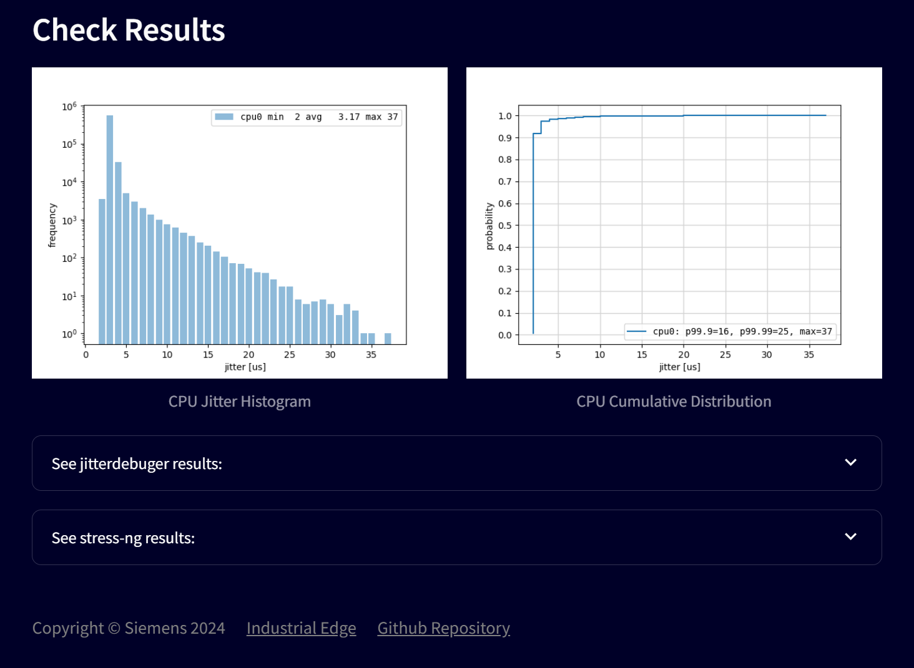
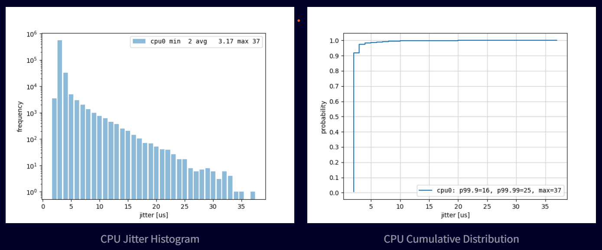
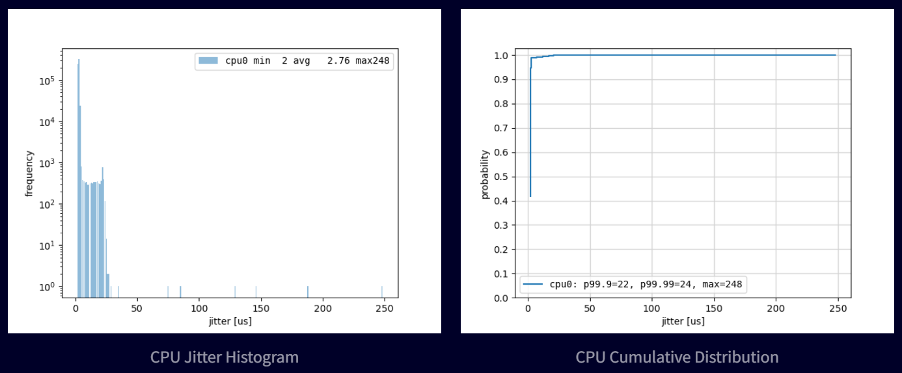
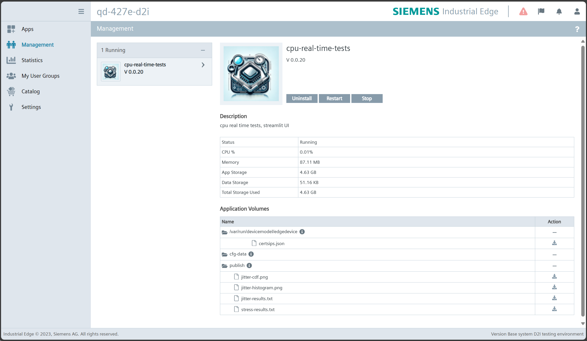

# CPU Real-Time Tests <!-- omit from toc -->

## Table of Contents <!-- omit from toc -->

- [Description](#description)
- [Requirements](#requirements)
  - [Prerequisites](#prerequisites)
  - [Used Components](#used-components)
- [Documentation](#documentation)
  - [Building and Deploying the App](#building-and-deploying-the-app)
  - [Running the App](#running-the-app)
  - [Analyzing the Test Results](#analyzing-the-test-results)
  - [Downloading the Test Results](#downloading-the-test-results)
- [Contribution](#contribution)
- [License and Legal Information](#license-and-legal-information)
- [Disclaimer](#disclaimer)

## Description

This app can be used by device builders to validate a device's real-time behavior and serves as an example for developing real-time applications on Industrial Edge.
It measures the jitter for a synthetic workload under system stress and displays the results.

Instructions on preparing an Industrial Edge device for executing real-time applications can be found in the [device builder documentation](https://industrial-edge.code.siemens.io/product/documentation/public-website/build_a_device/device_building/resource_manager/index.html#real-time-applications).
For introductory material and guidance on creating own Industrial Edge apps, please see the [documentation for app developers](https://docs.eu1.edge.siemens.cloud/develop_an_application/index.html).

## Requirements

### Prerequisites

- x86 CPU with at least two cores.

### Used Components

- Industrial Edge App Publisher (IEAP) v1.13.5
- Industrial Edge Device Kit (IEDK) v1.16.0-4
- Industrial Edge Device with [CPU allocation support being enabled](https://docs.eu1.edge.siemens.cloud/build_a_device/device_building/development/configuration/capabilitiesjson.html#hostresourcemanager)

## Documentation

### Building and Deploying the App

Take the file `docker-compose-example.yml` as an example, and simply run `docker-compose build` to generate all the necessary Docker images.
Then, use the Industrial Edge App Publisher (IEAP) to package the Docker images to an Industrial Edge app and publish it to your IEM.

> [!NOTE]  
> To use the main entry point of an Edge Device (reverse proxy on port 443) as the redirect target, you can use the IE App Publisher to define the reverse proxy behavior.
> The app's user interface can be accessed via port `8501`, which can be redirected.
> For detailed explanations, see [Redirect to Reverse Proxy](https://docs.eu1.edge.siemens.cloud/develop_an_application/ieap/app_redirection/redirect_to_reverse_proxy.html).

### Running the App

From the IEM, install the app onto an Industrial Edge device.

Upon successful installation, click on the app.
The app should be running and its web-based user interface should open in a new browser window.

At the top, a brief description of the two programs used for testing is given, namely [`jitterdebugger`](https://github.com/igaw/jitterdebugger) and [`stress-ng`](https://github.com/ColinIanKing/stress-ng).
In the "Run the test" section, you can specify the test duration and start the test by clicking the "START TEST" button.
By default, `jitterdebugger` runs on an isolated CPU core and `stress-ng` on all best-effort CPU cores.
This way, the performance of the isolated CPU core is measured under heavy load of the whole system.

Once the test is finished, i.e., the specified time has elapsed, the observed jitter is shown in two diagrams.
The histogram on the left-hand side displays the frequency, where the x-axis represents the time in microseconds.
The right-hand side shows the cumulative distribution, i.e., the probability that the latency is less than or equal to a certain value.
Optionally, the output of `jitterdebugger` and `stress-ng` can be displayed by expanding the corresponding sections below the diagrams.

> [!NOTE]
> Reliable and conclusive results require a sufficiently large test duration of at least multiple hours, ideally several days.

### Analyzing the Test Results

As the test results strongly depend on the target hardware, there is no general (absolute) threshold that could be used to determine whether the system is correctly prepared for executing real-time applications.
However, the plots show different patterns, which reflect the system's behavior in an intuitive way.

The following diagrams show an example for the *good case*.
In the histogram, there is a clear cut-off in terms of maximum latency in the two-digit microseconds range without any outliers.
The maximum observed latency is also seen in the cumulative distribution.

In contrast, the following plots show a *bad case*.
The histogram has a long tail with multiple sporadic outliers in the three-digits range.
The lack of a clear cut-off indicates that there is no upper bound on the latencies to be expected.

> [!NOTE]
> The histograms generated by `jitterdebugger` only show latencies up to 1000 microseconds.
> Longer latencies are tracked via the `max` field shown in the histograms' legend.
> As the cumulative distributions take the histogram values as input, the `max` values may differ.

### Downloading the Test Results

The test results are also stored in the `/publish` directory as `jitter-results.txt`, `jitter-histogram.png`, `jitter-cdf.png`, and `stress-results.txt`.
As a tester, you can download these files from the app management page on IED.

## Contribution

Thank you for your interest in contributing.
Please report bugs, unclear documentation, and other problems regarding this repository in the Issues section.
Additionally, feel free to propose any changes to this repository using Pull Requests.

If you haven't previously signed the [Siemens Contributor License Agreement](https://cla-assistant.io/industrial-edge/) (CLA), the system will automatically prompt you to do so when you submit your Pull Request.
This can be conveniently done through the CLA Assistant's online platform.
Once the CLA is signed, your Pull Request will automatically be cleared and made ready for merging if all other test stages succeed.

## License and Legal Information

Please read the [Legal information](LICENSE.txt).

## Disclaimer

IMPORTANT - PLEASE READ CAREFULLY:

This documentation describes how you can download and set up containers which consist of or contain third-party software.
By following this documentation, you agree that using such third-party software is done at your own discretion and risk.
No advice or information, whether oral or written, obtained by you from us or from this documentation shall create any warranty for the third-party software.
Additionally, by following these descriptions or using the contents of this documentation, you agree that you are responsible for complying with all third-party licenses applicable to such third-party software.
All product names, logos, and brands are property of their respective owners.
All third-party company, product, and service names used in this documentation are for identification purposes only.
Use of these names, logos, and brands does not imply endorsement.
